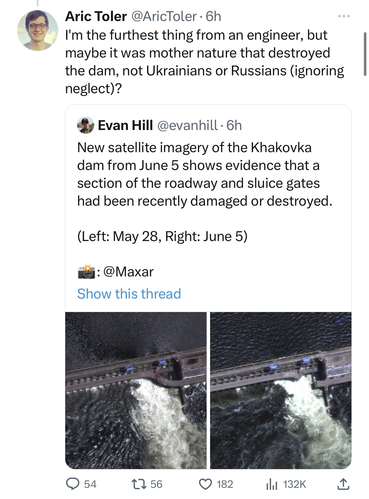

# Aric Toler

Since this wonderful person Aric Toler has a petty habit of deleting his more embarassing tweets without a proper retraction, this project preserves them for the ease of future reference.

Here you can find:

* [His last 100 tweets](last_100_tweets.csv) for easy viewing in the browser
* [All of his tweets](tweets.csv) that we've managed to save. It's too large for GitHub to render, but you can download it and import into your favorite spreadsheet software

